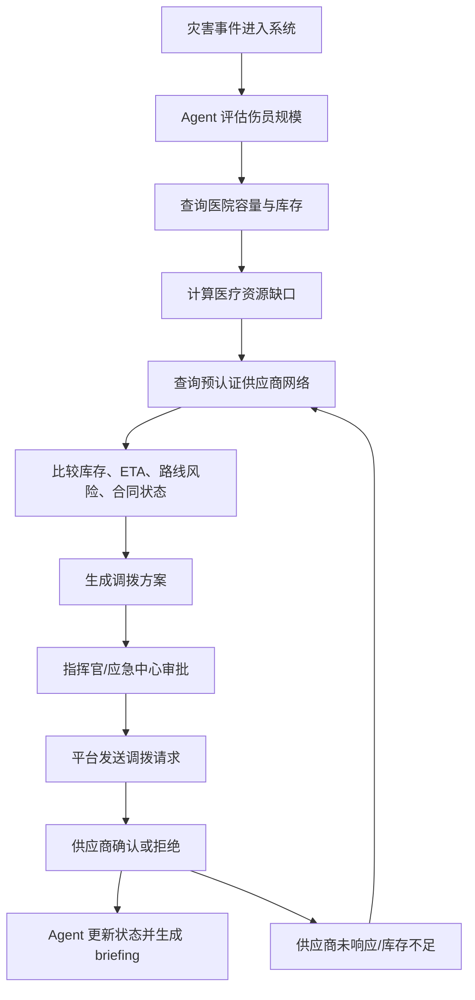
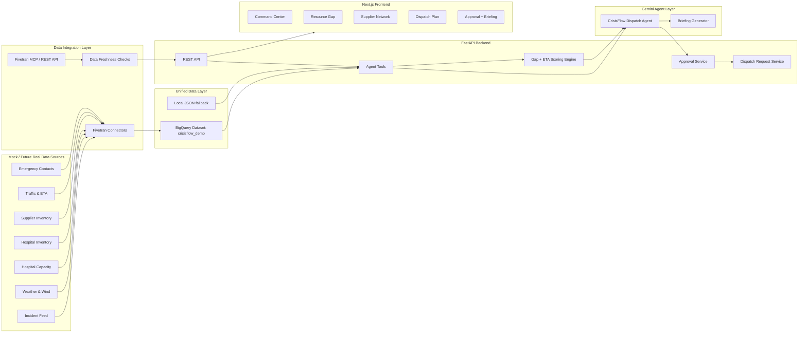
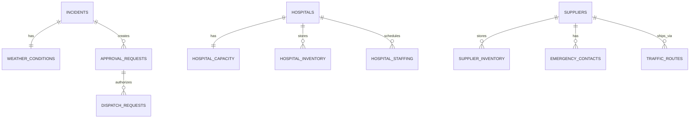
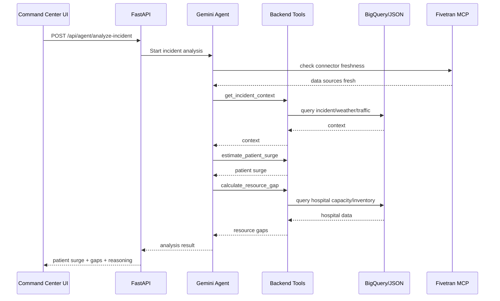
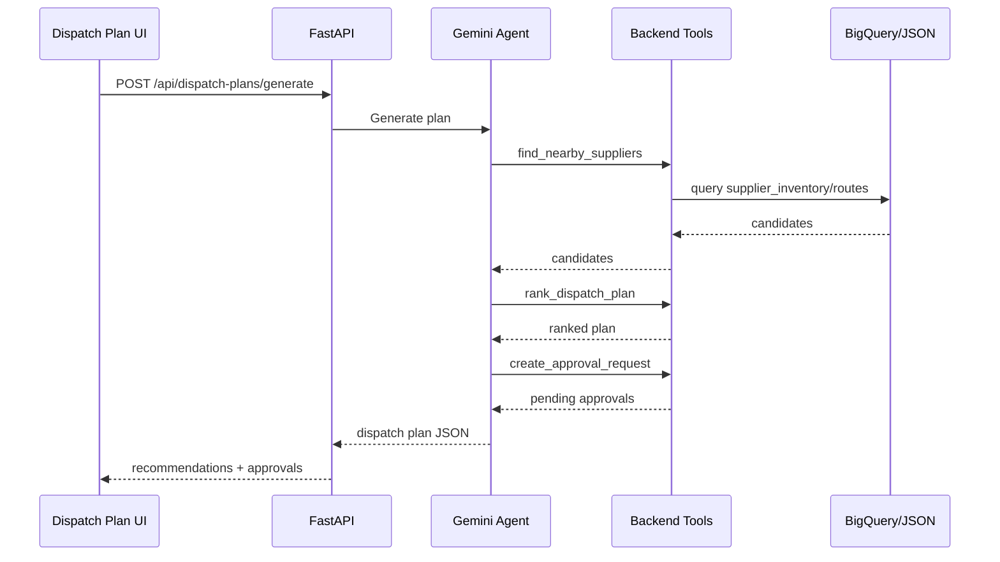
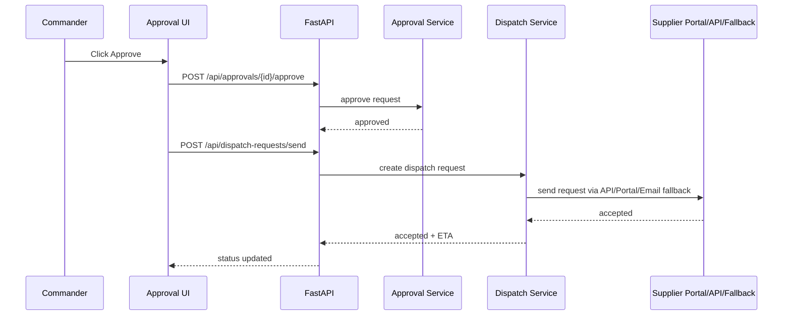
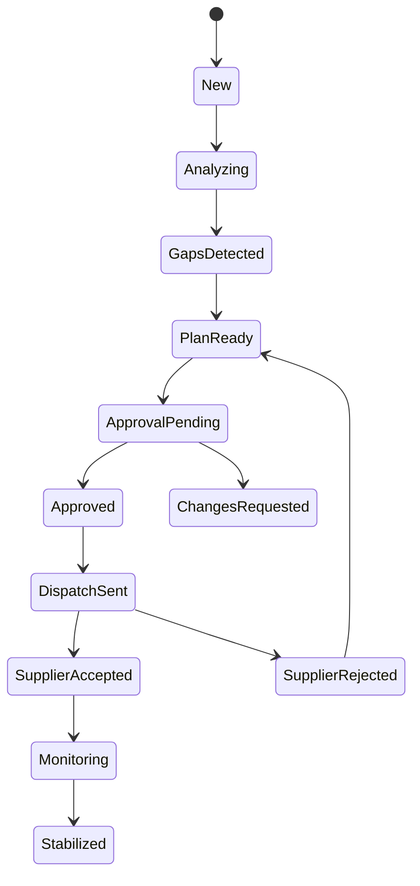

# CrisisFlow AI Technical Execution Plan

版本：Hackathon Engineering Plan v1.0
对应 PRD：[CrisisFlow_AI_PRD.md](./CrisisFlow_AI_PRD.md)
核心目标：两个人按本文档可以直接分工开发、录 demo、提交 Devpost
当前日期：2026-06-07

---

## 0. 先给结论

这个项目适合做 hackathon，但必须做成一个边界清楚的 MVP：

**CrisisFlow AI = 灾害发生后的医疗资源缺口预测 + 预认证供应商调拨 Agent。**

我们不做真实山火检测，不做真实医院接入，不做真实物流派单。我们做：

1. 一个可信的湾区山火场景。
2. 一组像真实系统的数据。
3. 一个能查询数据、计算缺口、比较 ETA、生成调拨方案的 Agent。
4. 一个让评委看懂的 Command Center。
5. 一个清楚的人类审批和供应商确认流程。

推荐技术栈：

```txt
Frontend: Next.js + TypeScript + Tailwind + Recharts + Map mock
Backend: Python FastAPI
Agent: Google ADK + Gemini, MVP 可先 direct Gemini SDK
Data: Local JSON first, BigQuery second
Partner MCP: Fivetran MCP for data pipeline / connector status
Deploy: Cloud Run
Optional: Arize Phoenix or Cloud Trace for observability
```

最重要的架构原则：

**Fivetran MCP 不直接负责找药品。Fivetran MCP 负责让 Agent 看到数据管道和同步状态；调度查询使用 BigQuery 里的统一数据层；业务计算由后端 tools 完成；Gemini 负责规划、解释和生成 briefing。**

---

## 1. 项目深度解析

### 1.1 用户真正痛点

灾害发生后的前 1-6 小时，应急团队最大的问题不是“完全没有数据”，而是：

- 医院床位、库存、人力在医院系统里。
- 供应商库存和出库能力在供应商系统里。
- 物流 ETA 和道路状态在交通/物流系统里。
- 灾情、风向、影响人口在应急系统里。
- 政府审批和正式调拨请求在另一套流程里。

这些数据分散，人在紧急情况下很难快速回答：

- 未来 2 小时会来多少伤员？
- 会缺哪些物资？
- 哪家医院先撑不住？
- 最近哪里有货？
- 运输多久到？
- 哪些行动要审批？
- 如果供应商没响应，备用方案是什么？

CrisisFlow 的价值就是把这些问题变成一个可执行的 Agent workflow。

### 1.2 产品核心闭环



### 1.3 Demo 里评委应该看到的效果

评委看完 3 分钟 demo 后应该能说出：

- 这个不是 chatbot，是一个会调用工具的 emergency dispatch agent。
- 它查了 incident、weather、hospital、inventory、supplier、traffic 数据。
- 它算出了 burn kits、albuterol、oxygen、ICU beds、nurses 的缺口。
- 它比较了不同供应商的 ETA 和路线风险。
- 它没有让 AI 自动调度，而是让 EOC/Health Department 审批。
- 它能审批后发出正式 Emergency Dispatch Request。
- Fivetran 的作用是把多系统数据接进 BigQuery，解决 emergency data fragmentation。

### 1.4 项目边界

MVP 必须做：

- Marin County wildfire 场景。
- Mock data。
- Dashboard。
- Resource gap calculation。
- Supplier ranking。
- Dispatch plan。
- Approval queue。
- Briefing generator。
- Fivetran/BigQuery 数据层故事。

MVP 不做：

- 真实火灾检测。
- 真实医院系统接入。
- 真实药企下单。
- 真实电话/短信。
- 复杂 GIS。
- 多灾种泛化。
- 复杂 ML 模型。

---

## 2. 系统总架构

### 2.1 高层架构图



### 2.2 MVP 三档实现

为了避免卡在云服务配置上，建议按三档做。

#### Level 1: 本地可跑版

目的：保证 demo 永远不会死。

```txt
Next.js -> FastAPI -> local JSON -> deterministic scoring -> Gemini optional
```

特点：

- 不依赖 BigQuery。
- 不依赖 Fivetran。
- 不依赖真实 MCP。
- 所有页面和业务流程能跑通。

#### Level 2: Google Cloud 版

目的：满足 Google Cloud 技术展示。

```txt
Next.js -> FastAPI on Cloud Run -> BigQuery -> Gemini
```

特点：

- Mock data 上传到 BigQuery。
- FastAPI 使用 BigQuery Python client 查询。
- Gemini 用来生成 explanation、briefing、public advisory。

#### Level 3: Partner MCP 版

目的：满足 Fivetran partner integration。

```txt
Fivetran MCP / REST API -> connector status + sync freshness -> Backend -> Agent
```

特点：

- Agent 或后端能显示数据源同步状态。
- 展示医院/供应商/交通数据 connector 是否 fresh。
- 可以触发 resync 或显示 "last synced 4 minutes ago"。
- 如果 MCP 接不起来，使用 Fivetran REST API 或模拟 connector status，不影响核心 demo。

---

## 3. Fivetran MCP 设计

### 3.1 Fivetran 在本项目里的正确角色

Fivetran 的价值不是“帮我们算调度”，而是：

- 管理数据源 connector。
- 把各系统数据同步到 BigQuery。
- 让 Agent 知道数据是否最新。
- 在数据过期时触发同步或提醒人工。
- 提供数据管道层面的审计。

### 3.2 Demo 中展示 Fivetran 的方式

UI 上做一个小模块：Data Source Health。

| Source | Connector | Last Sync | Status | Used By Agent |
|---|---|---:|---|---|
| Hospital Capacity | fivetran_hospital_capacity | 4m ago | Fresh | Yes |
| Hospital Inventory | fivetran_hospital_inventory | 5m ago | Fresh | Yes |
| Supplier Inventory | fivetran_supplier_inventory | 3m ago | Fresh | Yes |
| Traffic ETA | fivetran_traffic_routes | 2m ago | Fresh | Yes |
| Emergency Contacts | fivetran_emergency_contacts | 18m ago | Warning | Fallback only |

Agent 解释：

> I verified the Fivetran connector freshness before generating the dispatch plan. Hospital inventory, supplier stock, and traffic ETA data are fresh within 5 minutes.

### 3.3 Fivetran MCP / REST API 最小工具

如果使用 Fivetran MCP，工具可以是：

- `list_connectors`
- `get_connector_status`
- `get_connector_schema`
- `get_sync_history`
- `trigger_connector_sync`

如果使用 Fivetran REST API，后端封装：

```txt
GET /api/data-sources
POST /api/data-sources/{connector_id}/sync
```

### 3.4 数据新鲜度规则

```txt
Fresh: last_sync <= 10 minutes
Warning: 10 minutes < last_sync <= 30 minutes
Stale: last_sync > 30 minutes
Unknown: no connector status
```

Agent 规则：

- Fresh 数据可以用于推荐。
- Warning 数据可以用于推荐，但要在 plan 中标记 caution。
- Stale 数据不能自动生成 high-confidence dispatch plan。
- Stale 关键数据时，Agent 应请求刷新或人工确认。

---

## 4. 前端信息架构

### 4.1 页面列表

| Route | Page | 目标 |
|---|---|---|
| `/` | Command Center | 第一屏态势图和 Agent 状态 |
| `/incident/:id` | Incident Detail | 灾情解释和伤员预测 |
| `/resources/:id` | Resource Gap | 医院缺口计算 |
| `/suppliers/:id` | Supplier Network | 预认证供应商和库存 |
| `/plans/:id` | Dispatch Plan | 调拨方案和 ETA 对比 |
| `/approvals/:id` | Approval + Briefing | 审批、发送请求、生成简报 |

Hackathon 可以做成单页应用，用 tabs 或 sections 切换，不一定真的做路由。

### 4.2 Command Center 页面组件

```txt
CommandCenterPage
  IncidentSummaryBar
  SituationalMap
  AgentActivityPanel
  DataSourceHealthPanel
  OperationalTabs
    HospitalStatusTable
    ResourceSnapshotTable
    SupplierSnapshotTable
    TrafficStatusTable
```

### 4.3 Resource Gap 页面组件

```txt
ResourceGapPage
  PatientSurgeCard
  ResourceGapTable
  HospitalPressureCards
  AgentReasoningBox
  CTA: Generate Dispatch Plan
```

### 4.4 Dispatch Plan 页面组件

```txt
DispatchPlanPage
  PlanSummary
  RecommendationCards
  EtaComparisonTable
  RouteRiskPanel
  CTA: Submit for Approval
```

### 4.5 Approval 页面组件

```txt
ApprovalPage
  ApprovalQueue
  DispatchRequestPreview
  SupplierConfirmationTimeline
  BriefingGenerator
```

---

## 5. 后端模块设计

### 5.1 推荐目录结构

```txt
backend/
  app/
    main.py
    config.py
    api/
      routes_dashboard.py
      routes_agent.py
      routes_incidents.py
      routes_resources.py
      routes_suppliers.py
      routes_plans.py
      routes_approvals.py
      routes_briefings.py
      routes_datasources.py
    models/
      incident.py
      hospital.py
      supplier.py
      routing.py
      dispatch.py
      approval.py
      briefing.py
    services/
      data_repository.py
      bigquery_repository.py
      mock_repository.py
      incident_service.py
      surge_service.py
      hospital_service.py
      supplier_service.py
      routing_service.py
      gap_service.py
      ranking_service.py
      approval_service.py
      dispatch_service.py
      briefing_service.py
      datasource_service.py
    agent/
      crisisflow_agent.py
      tools.py
      prompts.py
    data/
      incidents.json
      weather_conditions.json
      hospitals.json
      hospital_capacity.json
      hospital_inventory.json
      hospital_staffing.json
      suppliers.json
      supplier_inventory.json
      traffic_routes.json
      emergency_contacts.json
      datasource_status.json
  tests/
    test_gap_service.py
    test_ranking_service.py
```

### 5.2 关键服务职责

| Service | 职责 |
|---|---|
| `incident_service` | 获取灾情、天气、交通、人口影响 |
| `surge_service` | 估算患者数量和类型 |
| `hospital_service` | 查询医院容量、库存、人力 |
| `gap_service` | 计算 needed、available、gap、time_to_shortage |
| `supplier_service` | 查询预认证供应商和库存 |
| `routing_service` | 查询 ETA 和路线风险 |
| `ranking_service` | 对供应来源打分排序 |
| `approval_service` | 生成、审批、拒绝审批请求 |
| `dispatch_service` | 审批后创建 dispatch request |
| `briefing_service` | 调 Gemini 生成 briefing |
| `datasource_service` | 查询 Fivetran connector 状态 |

---

## 6. API 设计

### 6.1 GET `/api/dashboard`

用途：Command Center 首屏数据。

Response:

```json
{
  "incident": {
    "incident_id": "INC-2026-0529-MARIN-014",
    "type": "wildfire",
    "location_name": "Marin County",
    "severity": "Level 4",
    "population_at_risk": 42000,
    "status": "active"
  },
  "summary": {
    "projected_patients": 180,
    "hospital_pressure": "High",
    "resource_gaps": 5,
    "approval_required": 4
  },
  "agent_activity": [
    "Incident received",
    "Weather and wind data checked",
    "Hospital capacity checked",
    "Supplier network queried"
  ],
  "data_sources": [
    {
      "name": "Hospital Inventory",
      "connector_id": "fivetran_hospital_inventory",
      "last_sync_minutes": 5,
      "status": "Fresh"
    }
  ]
}
```

### 6.2 POST `/api/agent/analyze-incident`

用途：触发 Agent 分析事故。

Request:

```json
{
  "incident_id": "INC-2026-0529-MARIN-014",
  "use_gemini": true,
  "check_data_freshness": true
}
```

Response:

```json
{
  "incident_id": "INC-2026-0529-MARIN-014",
  "classification": "Level 4",
  "patient_surge": {
    "total": 180,
    "burns": 35,
    "smoke_inhalation": 80,
    "trauma": 28,
    "icu_risk": 12,
    "observation": 25,
    "peak_arrival_hours": 2.5
  },
  "agent_summary": "Projected patient surge exceeds SF General burn and respiratory capacity within 2.5 hours."
}
```

### 6.3 GET `/api/resource-gaps/{incident_id}`

用途：返回资源缺口。

Response:

```json
{
  "incident_id": "INC-2026-0529-MARIN-014",
  "target_hospital": "SF General",
  "gaps": [
    {
      "resource": "Burn kits",
      "needed": 420,
      "available": 180,
      "gap": 240,
      "time_to_shortage_hours": 2.1,
      "severity": "Critical"
    },
    {
      "resource": "Albuterol doses",
      "needed": 300,
      "available": 180,
      "gap": 120,
      "time_to_shortage_hours": 1.8,
      "severity": "Critical"
    }
  ]
}
```

### 6.4 GET `/api/suppliers/search`

用途：按资源、数量、目的地搜索供应商。

Query:

```txt
resource=Burn kits&quantity=240&destination=HOSP-SFGH
```

Response:

```json
{
  "resource": "Burn kits",
  "quantity_needed": 240,
  "destination": "SF General",
  "candidates": [
    {
      "supplier_id": "SUP-OAK-MED",
      "supplier_name": "MedSupply Oakland",
      "available": 300,
      "eta_min": 42,
      "route": "I-580 -> Bay Bridge -> Mission St",
      "route_risk": "Medium",
      "contract_status": "pre_approved",
      "integration_type": "API",
      "score": 90.5,
      "recommendation": "Best"
    }
  ]
}
```

### 6.5 POST `/api/dispatch-plans/generate`

用途：根据缺口和供应商生成调拨方案。

Request:

```json
{
  "incident_id": "INC-2026-0529-MARIN-014",
  "target_hospital_id": "HOSP-SFGH",
  "include_briefing": false
}
```

Response:

```json
{
  "plan_id": "PLAN-2026-0529-014",
  "objective": "Cover critical shortages before second patient wave",
  "estimated_time_to_stabilize_hours": 2.5,
  "recommendations": [
    {
      "action_id": "ACT-001",
      "type": "supply_transfer",
      "title": "Transfer 300 burn kits from MedSupply Oakland to SF General",
      "resource": "Burn kits",
      "quantity": 300,
      "origin": "MedSupply Oakland",
      "destination": "SF General",
      "eta_min": 42,
      "why": "SF General has a 240-unit burn kit gap.",
      "risk_if_delayed": "Burn care shortage before second patient wave.",
      "approval_required": "Health Department",
      "confidence": "High"
    }
  ],
  "approval_requests": [
    {
      "approval_id": "APR-001",
      "action_id": "ACT-001",
      "required_approver": "Health Department",
      "status": "pending"
    }
  ]
}
```

### 6.6 POST `/api/approvals/{approval_id}/approve`

用途：审批某个调拨动作。

Request:

```json
{
  "approver_name": "EOC Commander",
  "approver_role": "Emergency Operations Center",
  "notes": "Approved under Level 4 wildfire emergency."
}
```

Response:

```json
{
  "approval_id": "APR-001",
  "status": "approved",
  "approved_at": "2026-05-29T17:45:00Z",
  "next_action": "dispatch_request_ready"
}
```

### 6.7 POST `/api/dispatch-requests/send`

用途：审批后发送正式调拨请求。

Request:

```json
{
  "approval_id": "APR-001",
  "channel_override": null
}
```

Response:

```json
{
  "dispatch_request_id": "EDR-2026-0529-014-A",
  "status": "sent",
  "supplier": "MedSupply Oakland",
  "contact_method": "API",
  "backup_method": "Email + SMS",
  "message": "Emergency Dispatch Request: Please release 300 burn kits to SF General under emergency authorization EOC-2026-0529-014."
}
```

### 6.8 POST `/api/briefings/generate`

用途：生成不同受众的 briefing。

Request:

```json
{
  "incident_id": "INC-2026-0529-MARIN-014",
  "plan_id": "PLAN-2026-0529-014",
  "audience": "mayor"
}
```

Response:

```json
{
  "audience": "mayor",
  "title": "Marin Wildfire Medical Surge Briefing",
  "body": "A 180-patient surge is projected over the next 2.5 hours. Critical medical resources are being coordinated across regional hospitals and pre-approved suppliers.",
  "generated_by": "Gemini",
  "requires_review": true
}
```

### 6.9 GET `/api/data-sources`

用途：展示 Fivetran connector / mock data source 状态。

Response:

```json
{
  "sources": [
    {
      "source_name": "Supplier Inventory",
      "connector_id": "fivetran_supplier_inventory",
      "last_sync_minutes": 3,
      "status": "Fresh",
      "records_loaded": 48
    }
  ]
}
```

---

## 7. 数据模型

### 7.1 ERD



### 7.2 最小表清单

| Table | 用途 | MVP 数据量 |
|---|---|---:|
| `incidents` | 灾情事件 | 1-3 rows |
| `weather_conditions` | 风速风向和空气质量 | 1-3 rows |
| `traffic_routes` | 路线 ETA 和风险 | 8-12 rows |
| `hospitals` | 医院主数据 | 4-6 rows |
| `hospital_capacity` | 床位容量 | 4-6 rows |
| `hospital_inventory` | 医院物资库存 | 20-40 rows |
| `hospital_staffing` | 医护人力 | 10-20 rows |
| `suppliers` | 预认证供应商 | 5-8 rows |
| `supplier_inventory` | 供应商库存 | 20-40 rows |
| `transport_options` | 物流车和冷链能力 | 5-8 rows |
| `approval_requests` | 审批单 | runtime generated |
| `dispatch_requests` | 调拨请求 | runtime generated |
| `emergency_contacts` | fallback 联系方式 | 5-8 rows |
| `datasource_status` | Fivetran/mock connector 状态 | 5-8 rows |

### 7.3 Mock 数据固定值

Incident:

```json
{
  "incident_id": "INC-2026-0529-MARIN-014",
  "type": "wildfire",
  "location_name": "Marin County",
  "severity": "Level 4",
  "population_at_risk": 42000,
  "projected_patients": 180,
  "peak_arrival_hours": 2.5
}
```

Patient surge:

| Type | Count | Main Need |
|---|---:|---|
| Burns | 35 | Burn kits |
| Smoke inhalation | 80 | Albuterol, oxygen |
| Trauma | 28 | ER beds, trauma staff |
| ICU risk | 12 | ICU beds |
| Observation | 25 | General beds |

Resource gaps:

| Resource | Needed | Available | Gap |
|---|---:|---:|---:|
| Burn kits | 420 | 180 | 240 |
| Albuterol doses | 300 | 180 | 120 |
| Oxygen cylinders | 90 | 54 | 36 |
| ICU beds | 12 | 7 | 5 |
| ER nurses | 28 | 20 | 8 |

Supplier candidates:

| Supplier | Resource | Available | ETA | Route Risk | Best For |
|---|---|---:|---:|---|---|
| MedSupply Oakland | Burn kits | 300 | 42m | Medium | Burn kits |
| UCSF Storage | Albuterol | 150 | 28m | Low | Respiratory meds |
| NorCal Oxygen | Oxygen cylinders | 80 | 91m | Low | Oxygen |
| Sacramento MedDepot | Burn kits | 900 | 138m | Medium | Backup burn kits |
| San Jose Warehouse | Oxygen cylinders | 120 | 104m | Low | Backup oxygen |

---

## 8. 核心算法

### 8.1 Patient Surge Estimate

MVP 不训练模型，使用规则型估算，Gemini 只负责解释。

```txt
base_patients = population_at_risk * exposure_rate

wildfire_level_4 exposure_rate = 0.0043
42000 * 0.0043 ~= 180
```

患者类型比例：

```txt
burns = total * 0.19
smoke_inhalation = total * 0.44
trauma = total * 0.16
icu_risk = total * 0.07
observation = remaining
```

### 8.2 Resource Demand Formula

```txt
burn_kits_needed = burns * 12
albuterol_needed = smoke_inhalation * 3.75
oxygen_cylinders_needed = severe_respiratory_cases * 3
icu_beds_needed = icu_risk
er_nurses_needed = ceil(total_patients / 6.5)
```

### 8.3 Gap Calculation

```txt
gap = max(needed - available, 0)

severity:
  Critical if gap > 0 and time_to_shortage <= 2.25h
  High if gap > 0 and time_to_shortage <= 3.0h
  Medium if gap > 0
  Stable if gap == 0
```

### 8.4 Supplier Ranking

```txt
score =
  inventory_fit_score * 0.35
  + eta_score * 0.35
  + route_safety_score * 0.15
  + contract_score * 0.10
  + integration_score * 0.05
```

Scoring:

| Factor | 100 | 75/80 | 50/60 | 0/25/40 |
|---|---|---|---|---|
| Inventory | Covers full gap | Covers 50%-99% | Covers <50% | No stock |
| ETA | <=45m | 46-90m | 91-150m | >150m |
| Route | Low risk | Medium risk | High risk | Blocked |
| Contract | Pre-approved | Existing vendor | Portal only | Emergency contact only |
| Integration | API | Portal | Email/SMS | Unknown |

---

## 9. Agent 设计

### 9.1 单 Agent MVP

先做一个 Agent：

```txt
CrisisFlow Dispatch Agent
```

职责：

- 检查数据新鲜度。
- 查询灾情。
- 估算患者规模。
- 计算资源缺口。
- 搜索供应商。
- 生成调拨方案。
- 创建审批单。
- 生成 briefing。

### 9.2 Tool Call 流程



### 9.3 Dispatch Plan Sequence



### 9.4 Approval and Dispatch Sequence



### 9.5 Agent System Prompt 要点

Agent 必须遵守：

- Use tools before making operational recommendations.
- Always cite the data used in each recommendation.
- Do not execute dispatch without explicit approval.
- If data is stale, lower confidence and request refresh or human confirmation.
- Return structured JSON for UI rendering.
- Separate prediction, recommendation, approval, and execution.

---

## 10. 状态机设计

### 10.1 Incident State



### 10.2 Dispatch Request State

```txt
draft -> pending_approval -> approved -> sent -> supplier_pending -> accepted -> in_transit -> delivered
                                               -> rejected -> backup_required
```

---

## 11. Demo 展示设计

### 11.1 最佳演示路径

1. 打开 Command Center。
2. 看到 Marin Wildfire 和 Agent activity。
3. 点击 Analyze Incident。
4. Resource Gap 表出现。
5. 点击 Generate Dispatch Plan。
6. 看见 ETA ranking 和推荐卡片。
7. 点击 Submit for Approval。
8. Approve Dispatch Plan。
9. Send Dispatch Request。
10. Supplier Accepted。
11. Generate Mayor Briefing。

### 11.2 画面重点

每个画面只讲一个点：

- Command Center：事故很严重，数据正在被查。
- Resource Gap：缺什么，缺多少，多久后缺。
- Supplier Network：哪里有货，多久能到。
- Dispatch Plan：Agent 推荐什么，为什么。
- Approval：AI 不直接执行，人类审批。
- Briefing：自动生成可沟通文本。

### 11.3 3 分钟脚本

```txt
0:00-0:20
Problem: emergency teams have fragmented data and no time.

0:20-0:45
Marin wildfire enters CrisisFlow Command Center.

0:45-1:15
Agent verifies Fivetran-connected data sources and queries hospital/supplier/traffic data.

1:15-1:45
Agent predicts 180 patients and identifies critical resource gaps.

1:45-2:20
Agent ranks suppliers by inventory, ETA, route risk, and contract status.

2:20-2:45
Commander approves the dispatch plan.

2:45-3:00
CrisisFlow sends emergency dispatch requests and generates mayor/EOC briefing.
```

---

## 12. 两人分工

建议两个人做。不要一个人全包，除非另一个人完全不参与技术。

### 12.1 Person A: Frontend + Product Demo Owner

目标：让产品看起来像一个真实 command center，让评委 10 秒看懂。

负责：

- Next.js 项目搭建。
- 页面布局和视觉风格。
- Command Center。
- Mock map。
- Resource Gap 表。
- Supplier Network 表。
- Dispatch Plan 卡片。
- Approval Queue。
- Briefing 展示。
- Demo flow polish。
- 录屏脚本和 Devpost 截图。

不负责：

- Agent tool 细节。
- BigQuery 查询。
- Fivetran MCP。
- 复杂 scoring 逻辑。

交付物：

- `/frontend` 可运行。
- 所有页面接后端 API。
- API 没好时能用 mock response。
- 录屏时页面稳定、好看、不露 bug。

### 12.2 Person B: Backend + Agent + Data Owner

目标：让产品真的有逻辑，不是静态 PPT。

负责：

- FastAPI 项目搭建。
- Mock data。
- 数据模型。
- Resource gap calculation。
- Supplier ranking。
- Approval state。
- Dispatch request state。
- Gemini/ADK integration。
- Fivetran MCP/REST or mock datasource status。
- BigQuery integration。
- Cloud Run deployment。

不负责：

- 前端视觉细节。
- 页面布局。
- 视频剪辑。

交付物：

- `/backend` 可运行。
- API 文档。
- deterministic scoring。
- Agent 可以生成 plan 和 briefing。
- 数据源状态可以展示 Fivetran story。

### 12.3 共同负责

- 产品故事线。
- Demo 脚本。
- Devpost 文案。
- 最终演示顺序。
- 确认页面和 API 对齐。

---

## 13. 两人每日计划

### Day 1: 固定故事和数据

Person A:

- 画低保真页面。
- 搭 Next.js。
- 做 Command Center 静态版。

Person B:

- 搭 FastAPI。
- 写 mock JSON。
- 写 `GET /api/dashboard`。
- 写 `GET /api/resource-gaps/{incident_id}`。

共同：

- 确认 mock data 数字不再变。
- 确认页面字段和 API 字段。

### Day 2: 资源缺口和供应商排序

Person A:

- 做 Resource Gap 页面。
- 做 Supplier Network 页面。
- 接 dashboard/gaps API。

Person B:

- 写 gap_service。
- 写 ranking_service。
- 写 supplier search API。
- 写单元测试。

共同：

- 用固定数据跑一次完整 gap -> supplier search。

### Day 3: Dispatch Plan 和审批

Person A:

- 做 Dispatch Plan 页面。
- 做 Approval Queue 页面。

Person B:

- 写 `/api/dispatch-plans/generate`。
- 写 `/api/approvals/{id}/approve`。
- 写 `/api/dispatch-requests/send`。

共同：

- 跑通 Analyze -> Plan -> Approve -> Send。

### Day 4: Gemini 和 briefing

Person A:

- 做 Briefing Generator UI。
- 做 Agent activity 动画/状态。
- Polish UI。

Person B:

- 接 Gemini。
- 写 Agent prompt。
- 写 briefing API。
- 将 Gemini 输出限制为结构化 JSON 或 markdown。

共同：

- 决定哪些内容 Gemini 生成，哪些内容 deterministic。

建议：

- 调度数字和 ranking 必须 deterministic。
- Gemini 只生成自然语言解释和 briefing。

### Day 5: Fivetran / BigQuery / Cloud Run

Person A:

- 做 Data Source Health panel。
- 准备 demo 截图和视频素材。

Person B:

- 上传 mock data 到 BigQuery。
- 接 BigQuery repository。
- 接 Fivetran MCP 或 REST/mock connector status。
- 部署后端到 Cloud Run。

共同：

- 如果 MCP 卡住，立刻改为 REST/mock datasource status，不影响 demo。

### Day 6: 录视频和提交

Person A:

- 录屏。
- 剪视频。
- 做 Devpost images。

Person B:

- 部署稳定化。
- README。
- 环境变量说明。
- 处理 bug。

共同：

- 写 Devpost。
- 练 3 分钟讲解。

---

## 14. 实现优先级

### P0: 必须完成

- Mock data。
- FastAPI。
- Command Center。
- Resource Gap。
- Supplier Ranking。
- Dispatch Plan。
- Approval Flow。
- Briefing。

### P1: 强烈建议完成

- Gemini briefing。
- Data Source Health。
- Cloud Run deployment。
- BigQuery integration。

### P2: 有时间再做

- Fivetran MCP true integration。
- Arize/Cloud Trace observability。
- 更真实地图。
- Supplier portal 独立页面。

---

## 15. 风险和兜底

### 15.1 风险：Fivetran MCP 配不起来

兜底：

- 使用 Fivetran REST API。
- 仍不行就 mock `/api/data-sources`。
- Demo 里讲 "Fivetran-connected data layer"，不要让核心调度依赖 MCP 成功。

### 15.2 风险：Gemini 输出不稳定

兜底：

- 所有数字和 plan 用 deterministic 后端生成。
- Gemini 只负责 briefing 文案。
- 如果 Gemini 失败，使用 fallback briefing template。

### 15.3 风险：前端时间不够

兜底：

- 做单页 dashboard，用 tabs 切换。
- 不做复杂地图，用静态 mock map + markers。

### 15.4 风险：BigQuery 权限卡住

兜底：

- 本地 JSON repository 保持可用。
- Backend 使用 `DATA_MODE=mock|bigquery` 切换。

---

## 16. 代码启动建议

### 16.1 Monorepo 结构

```txt
crisisflow-ai/
  frontend/
    package.json
    src/
      app/
      components/
      lib/api.ts
      types/
  backend/
    pyproject.toml
    app/
    tests/
  data/
    csv/
    json/
  docs/
    CrisisFlow_AI_PRD.md
    CrisisFlow_Technical_Execution_Plan.md
  README.md
```

### 16.2 环境变量

Frontend:

```txt
NEXT_PUBLIC_API_BASE_URL=http://localhost:8000
```

Backend:

```txt
DATA_MODE=mock
GOOGLE_CLOUD_PROJECT=your-project
BIGQUERY_DATASET=crisisflow_demo
GEMINI_API_KEY=your-key
FIVETRAN_API_KEY=optional
FIVETRAN_API_SECRET=optional
```

### 16.3 后端本地启动

```txt
cd backend
uvicorn app.main:app --reload --port 8000
```

### 16.4 前端本地启动

```txt
cd frontend
npm run dev
```

---

## 17. 验收清单

### 17.1 产品验收

- 打开页面能看到 wildfire incident。
- 点击 analyze 能看到患者预测。
- 能看到资源缺口表。
- 能看到供应商排序。
- 能看到 dispatch plan。
- 能审批。
- 能发送 dispatch request。
- 能生成 briefing。

### 17.2 技术验收

- 后端 API 能跑。
- 前端不依赖硬编码也能渲染主要数据。
- Gap calculation 有测试。
- Supplier ranking 有测试。
- Gemini 失败时有 fallback。
- `DATA_MODE=mock` 可跑。
- 如果接 BigQuery，`DATA_MODE=bigquery` 可跑。

### 17.3 Demo 验收

- 3 分钟内讲完。
- 每一页不超过一个核心信息。
- 没有真实医疗建议承诺。
- 明确说 human-in-the-loop。
- 明确说数据是 hackathon simulated datasets。
- 明确说 production 由 Fivetran 接入真实系统。

---

## 18. 推荐讲法

英文：

> CrisisFlow is a Gemini-powered emergency medical supply coordination agent. When a wildfire creates a patient surge, it verifies Fivetran-connected data freshness, checks hospital capacity and inventory, calculates critical resource gaps, ranks pre-approved suppliers by stock, ETA, route risk, and contract status, then generates an approval-ready dispatch plan for emergency operations teams.

中文：

> CrisisFlow 是一个面向灾害应急的医疗资源调度 Agent。灾害发生后，它先确认多源数据是否最新，再预测伤员规模，检查医院药品、床位和人力，计算资源缺口，并在城市预认证供应商网络中比较库存、ETA、路线风险和合同状态，最终生成需要应急中心审批的调拨方案。

---

## 19. 官方资料依据

- Google Agent Platform / ADK：Google 文档说明 Agent Platform 支持通过 ADK 构建复杂 tool-use agents，并提供 agent lifecycle、governance、observability 等能力。
  https://docs.cloud.google.com/gemini-enterprise-agent-platform/overview

- Google Agent runtime / scale：Google 文档说明 Agent Platform 提供 fully managed runtime、context management、observability 等生产化能力。
  https://docs.cloud.google.com/gemini-enterprise-agent-platform/scale

- Google ADK tools：ADK 文档说明 tools 让 agent 能执行外部能力，Python function signature/docstring 可用于生成工具 schema。
  https://google.github.io/adk-docs/tools-custom/function-tools/

- Cloud Run + FastAPI：Google Cloud Run 文档提供 Python FastAPI web app 部署 quickstart。
  https://docs.cloud.google.com/run/docs/quickstarts/build-and-deploy/deploy-python-fastapi-service

- Fivetran Hackathon resource：Devpost 明确 Fivetran 提供 MCP 示例服务器和 REST API 两种集成方式，并说明 BigQuery destination quickstart。
  https://rapid-agent.devpost.com/details/fivetran-resources

- Fivetran MCP blog：Fivetran 官方博客说明 MCP 可让 AI assistant 通过工具化方式管理 Fivetran API，并支持 approval workflow、audit trail 等治理思路。
  https://www.fivetran.com/fr/blog/integrate-data-faster-using-natural-language-fivetran-and-mcp
